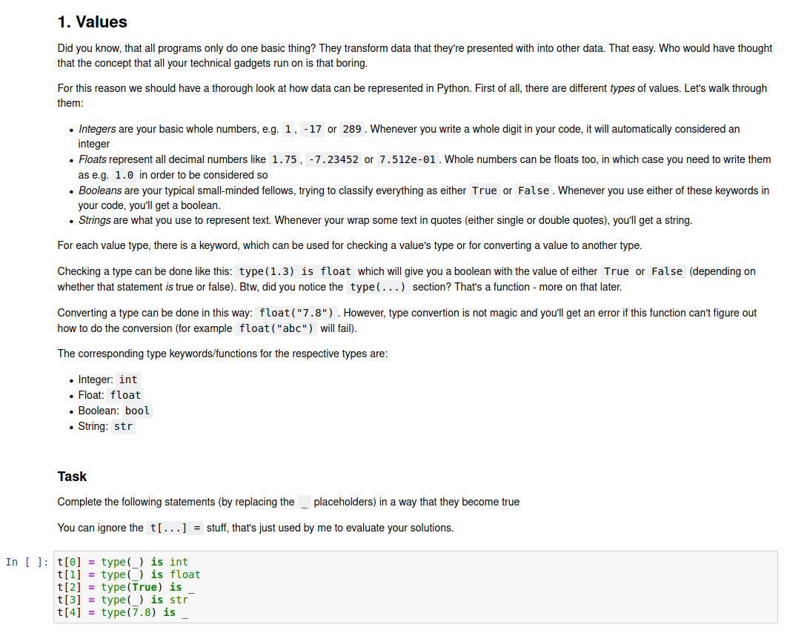

# Pyschool

## Description

This is a (work in progress) programming/python course I wrote for some friends of mine.
Currently, it covers data types & variables, operators, and control structures.

It uses Jupyter notebooks to implement interactive tasks and validation of solutions.

**Example:**



## Set up

```sh
  git clone https://github.com/theCalcaholic/pyschool.git
  cd pyschool
  docker build -t pyschool .
  # For other architectures than amd64, provide the ARCHITECTURE build-arg, e.g.:
  # docker build -t pyschool --build-arg ARCHITECTURE armhf/arm64/i386 .
  docker run -p 127.0.0.1:8080:80 pyschool
```

If you used the commands above, you can now access the web interface at https://127.0.0.1:8080
Check the container logs for the automatically generated admin password.
